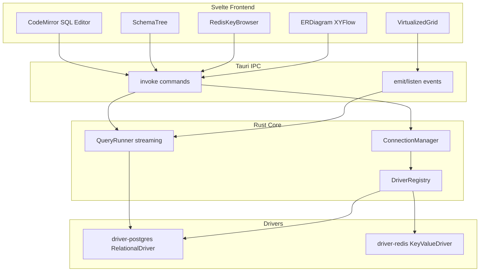
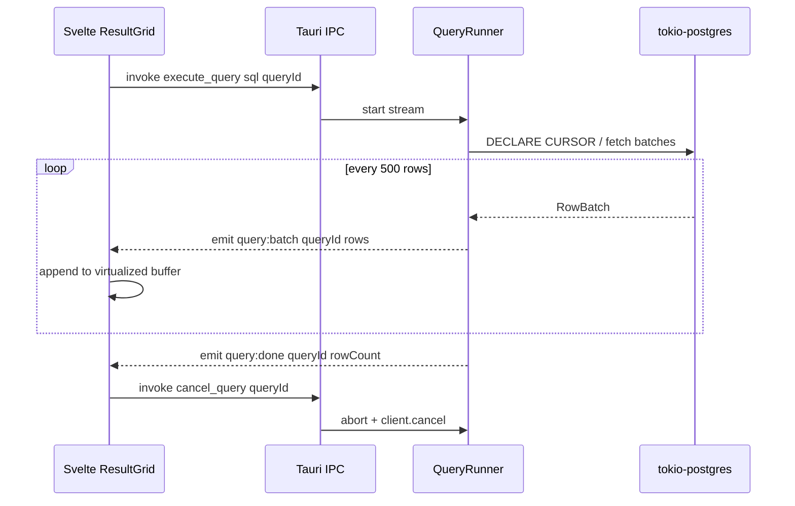

# Plan: DB Client with Tauri + Rust + Svelte

## Objective

Build a lightweight alternative to DBeaver for personal use, with potential open-source release. Initial focus: **Postgres + Redis**. Architecture prepared for the community to add engines without touching the core.

## Stack

| Layer | Technology |
|------|------------|
| Desktop shell | Tauri 2 |
| Backend / drivers | Rust (Tokio async) |
| UI | Svelte 5 + TypeScript + Vite |
| SQL Editor | CodeMirror 6 |
| Result Grid | `@tanstack/svelte-virtual` |
| ER Diagrams | `@xyflow/svelte` + auto-layout (`dagre` or `elkjs`) |
| Postgres | `tokio-postgres` (native cursors for streaming) |
| Redis | `redis` crate (with `tokio-comp` feature) |
| Mac Credentials | `keyring` crate (Keychain) |
| License (recommended) | MIT |

## Architecture



### Design rules (from day 1)

1. **Backend streaming:** Postgres never buffers the full result set; it reads chunks of ~500 rows via a cursor.
2. **Frontend virtualization:** the grid renders only visible rows (~40 DOM nodes), even if the scrollbar represents millions.
3. **Batched IPC:** the main Rust process emits `query:batch` events with chunks; never a giant array in a single `invoke`.
4. **Cancellation:** each query has a `queryId`; cancel → `client.cancel()` + aborting the Tokio stream.
5. **Redis:** browse with `SCAN`, never `KEYS *`.
6. **Credentials:** passwords in Keychain; local config only stores host/port/user/db (no plaintext secrets).

## Repo structure (Cargo + Svelte monorepo)

New repository, independent of the `api/` workspace:

```text
db-client/
├── Cargo.toml                  # workspace
├── crates/
│   ├── driver-api/             # traits + shared types
│   ├── driver-postgres/
│   ├── driver-redis/
│   └── core/                   # ConnectionManager, QueryRunner, registry
├── src/                          # Svelte UI
│   ├── lib/
│   │   ├── components/
│   │   │   ├── SqlEditor/
│   │   │   ├── ResultGrid/       # TanStack Virtual
│   │   │   ├── SchemaTree/
│   │   │   ├── RedisBrowser/
│   │   │   └── ErDiagram/
│   │   ├── stores/               # connections, tabs, query state
│   │   └── api/                  # wrappers invoke + listen
│   └── routes/                   # if using SvelteKit; or App.svelte flat
├── src-tauri/
│   ├── src/
│   │   ├── lib.rs                # Tauri commands, registers drivers
│   │   └── state.rs              # shared AppState
│   └── tauri.conf.json
├── CONTRIBUTING.md               # how to add a driver (open-source phase)
├── LICENSE
│   └── README.md
```

## Driver contract (`crates/driver-api`)

Two separate traits by **kind**, not a single generic interface:

```rust
// Conceptual — do not implement all at once
pub enum DriverKind { Relational, KeyValue }

pub struct DriverManifest {
    pub id: String,           // "postgres" | "redis"
    pub kind: DriverKind,
    pub display_name: String,
    pub default_port: u16,
}

#[async_trait]
pub trait RelationalDriver: Send + Sync {
    async fn test_connection(&self, config: &ConnectionConfig) -> Result<()>;
    async fn list_schemas(&self) -> Result<Vec<SchemaInfo>>;
    async fn list_tables(&self, schema: &str) -> Result<Vec<TableInfo>>;
    async fn describe_table(&self, schema: &str, table: &str) -> Result<TableSchema>;
    async fn get_table_ddl(&self, schema: &str, table: &str) -> Result<String>;
    async fn get_schema_graph(&self, schema: &str) -> Result<SchemaGraph>; // ER
    async fn execute_query_stream(
        &self, sql: &str, batch_size: usize,
    ) -> Result<Pin<Box<dyn Stream<Item = Result<RowBatch>> + Send>>>;
    async fn cancel_query(&self, query_id: &str) -> Result<()>;
}

#[async_trait]
pub trait KeyValueDriver: Send + Sync {
    async fn test_connection(&self, config: &ConnectionConfig) -> Result<()>;
    async fn scan_keys(&self, pattern: &str, cursor: u64, count: usize)
        -> Result<ScanResult>;
    async fn get_key(&self, key: &str) -> Result<KeyValue>;
    async fn set_key(&self, key: &str, value: &KeyValue) -> Result<()>;
    async fn delete_key(&self, key: &str) -> Result<()>;
    async fn server_info(&self) -> Result<ServerInfo>;
}
```

`DriverRegistry` maps `driver_id → impl trait`. Adding MySQL in the future = new `driver-mysql` crate implementing `RelationalDriver` + registration in `lib.rs`.

## Query flow with streaming



## Implementation phases

### Phase 0 — Scaffold (Week 1)

- Create repository with `npm create tauri-app` (using the **Svelte + TypeScript** template).
- Convert to a **Cargo workspace** with crates: `driver-api`, `core`, `driver-postgres`, `driver-redis`.
- Configure Tauri 2 for Mac (targets `aarch64-apple-darwin`, `x86_64-apple-darwin`).
- Base UI: layout with sidebar (connections), central panel (tabs), and status bar.
- Dark/light theme using CSS variables.

### Phase 1 — Postgres core (Weeks 2–3)

**Backend (`driver-postgres`):**

- Connection via `tokio-postgres` + pool by `connectionId`.
- Introspection: schemas, tables, columns via `information_schema` / `pg_catalog`.
- `execute_query_stream` using a server-side cursor.
- `cancel_query` mapping `queryId` + `client.cancel()`.

**Frontend:**

- Postgres connection form (host, port, db, user, password).
- `SchemaTree`: lazy load (expand schema → fetch tables → expand table → columns).
- `SqlEditor` (CodeMirror 6): SQL syntax highlighting, ⌘↵ to execute selection or everything.
- Virtualized `ResultGrid` consuming `query:batch` events.
- One tab per connection.

**Initial Tauri commands:**

- `save_connection`, `list_connections`, `connect`, `disconnect`
- `list_schemas`, `list_tables`, `describe_table`
- `execute_query`, `cancel_query`

### Phase 2 — Security and persistence (Week 4)

- Passwords in **Keychain** via `keyring` (service name = app id, account = connection id).
- Local config in `~/.config/db-client/connections.json` (without passwords).
- Test connection before saving.
- User-friendly error handling in the UI (toast / inline).

### Phase 3 — Redis driver (Weeks 5–6)

**Backend (`driver-redis`):**

- Standalone connection (TLS optional in v1.1).
- Paged `scan_keys` using Redis cursor.
- `get_key` / `set_key` / `delete_key` for types: string, hash, list (sets/zsets in v1.1).
- `server_info` (INFO memory, version).

**Frontend:**

- Distinct panel depending on `DriverKind`: if Redis, show `RedisBrowser` instead of the SQL editor.
- Key search/filtering, key-type viewer, visible TTL.
- Inline editing of string/hash fields.

### Phase 4 — ER diagrams (Weeks 7–8)

**Backend:**

- `get_schema_graph(schema)` in `driver-postgres`: nodes (tables + PK/FK columns) and edges (foreign keys) from `information_schema`.

**Frontend (`ErDiagram`):**

- `@xyflow/svelte` with custom nodes (table + columns).
- Auto-layout using `dagre`.
- Click on node → open DDL / describe table in a sidebar panel.
- Schema selector to specify which schemas to include.
- SVG Export (nice-to-have for this phase).

### Phase 5 — Productivity (Weeks 9–10)

- Local query history per connection (embedded SQLite in `~/.config/db-client/history.db` or JSONL file).
- Saved SQL snippets.
- Export Postgres results → CSV / JSON (streamed write from Rust, without loading everything into the UI).
- Command palette (⌘K): connect, new query, search table, toggle theme.
- Restore tabs when reopening the app.

### Phase 6 — Open source readiness (Week 11+)

- README with screenshots/GIFs, prerequisites, and build instructions.
- `CONTRIBUTING.md`: "How to add a driver in 5 steps" (implement trait → crate → register → tests).
- Rust tests in `driver-postgres` and `driver-redis` (using testcontainers or Docker in CI).
- GitHub Actions: `cargo test`, `cargo clippy`, Tauri Mac build.
- MIT License + `CODE_OF_CONDUCT.md`.
- Issue templates: bug, feature, new driver request.

## What to explicitly leave out of the MVP

- SSH tunnels (v1.1 if you use it daily)
- Redis Cluster / Sentinel
- Windows/Linux support (Mac-first; multi-platform Tauri later)
- External plugin marketplace (WASM) — only workspace-internal crates
- AI SQL assistant
- Multi-DB in a single query

## Key technical decisions

| Decision | Choice | Reason |
|----------|----------|-------|
| Postgres driver | `tokio-postgres` | Native cursors, direct cancellation |
| vs `sqlx` | `tokio-postgres` for ad-hoc queries | `sqlx` shines in dynamic SQL compiler-time queries, not in a dynamic SQL editor |
| IPC streaming | Tauri **events** (`emit`) | `invoke` is request/response; events allow pushing batches |
| UI routing | SvelteKit or flat Svelte | SvelteKit if you want routes; flat Svelte is simpler for desktop |
| ER layout | `dagre` | Sufficient for the MVP; ELK if the graph grows |

## Commands to get started (on the other machine)

```bash
npm create tauri-app@latest db-client
# Choose: Svelte + TypeScript + npm/pnpm

cd db-client
# Restructure to Cargo workspace (manual, phase 0)
cargo add tokio-postgres --features with-chrono-0_4
cargo add redis --features tokio-comp
cargo add keyring
cargo add async-trait serde serde_json
pnpm add @tanstack/svelte-virtual codemirror @xyflow/svelte dagre
```

## Success metrics (to validate it meets the vision)

- Startup time under 2 s on Mac
- Idle RAM under 80 MB (vs DBeaver ~500 MB+)
- `SELECT *` of 100k rows: responsive UI, fluid scrolling, instantaneous cancel
- ER diagram of a schema with 30 tables rendered in less than 1 s
- Adding a new driver without modifying UI core (only registration + conditional panel based on `DriverKind`)

## Risks and mitigations

| Risk | Mitigation |
|--------|------------|
| Rust learning curve | Isolated drivers in crates; UI in Svelte/TS where you're already comfortable |
| IPC overhead with batches | Tunable batch size (500 default); binary/MessagePack if JSON is slow |
| ER with huge schemas | Lazy render, filter schemas, limit visible nodes |
| Keychain in dev | Fallback env var in `debug` builds only |
